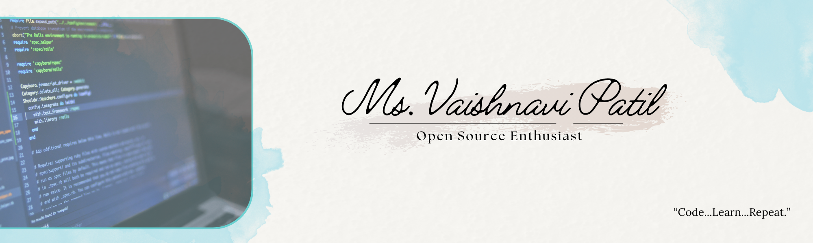

# VaishProfile
<h2 align="center">Hello World! 👋  My name is Vaishnavi Patil, and I'm an IT enthusiast with a strong background in Computer Science!</h2> 

<h3 align="center">⚡Check out my portfolio for more details about my projects, skills, and achievements⚡</h3>

[https://sites.google.com/view/msvaishnavipatil-portfolio/home] 
It provides a deeper look into who I am, what I’ve worked on, and how I can contribute to tech projects.

 

  

###

  
<h3 align="center">🛠 Tech ToolBox & Links</h3> 
  
  
  
  
  
  
  
  
  
  
  
  
  
  
  
  
  
  
  

###

  
  
  
  
  

  

<h1 align="center">📝 About me</h1>

###

- ✨ Creating bugs since I wrote my first line of code. - 👩‍💻 A lifelong learner, problem solver, creator, bug resolver. - 📚 I'm currently pursuing my MCA from University of Mumbai.  Alongside, I'm doing a stipend-based internship, where I’m working with ActionScript to develop kids' apps. - 🎯 Goals: My goal is to contribute to various projects. I aspire to become part of an IT scholar's community and collaborate on impactful tech projects. - 🎲 Fun fact: I enjoy working on creative projects and am always excited to explore new technologies!
  

###

<h1 align="center">👨‍💻 Tools & IDEs I Use for Coding</h1>
Here are the tools, software, and technologies I use to develop, debug, and create amazing projects:

###

## 🖥️ **Development Tools**
- **Dev C++** – For lightweight C & C++ development.  
- **Turbo C++** – For classic C & C++ programming.  
- **Visual Studio Code** – My go-to code editor for most projects.  
- **IntelliJ IDEA** **&** **Notepad** – For Java development.
- **Adobe** **Animate** **2023** – For Game development using ActionScript.  
- **PyCharm** **&** **Python** – For Python development.  
- **Eclipse IDE** **&** **NetBeans** – For Java.  

###

## 🛠️ **Version Control & Collaboration**
- **Git** – For version control.  
- **GitHub** – To host and collaborate on projects.
  
###

## ⚙️ **Frameworks & Frontend Technologies**
- **React.js** 
- **Spring Boot** 
- **Bootstrap**

###

## 🛢️ **Databases & Other Tools**
- **MySQL Workbench** – For managing MySQL databases.  
- **Postman** – For API testing.
- **Notion** – For note-taking and organization.
  
###
